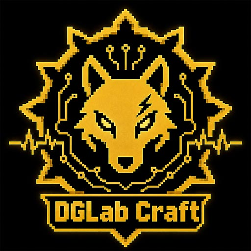

# DGLab Craft

<p align="center"></p>

[English Version](./README_EN.md)


## ⬇️ 下载 Download

[](https://modrinth.com/mod/dglab-craft)
[](https://www.curseforge.com/minecraft/mc-mods/dglab-craft)

> 当前分支：`1.19.2`

DGLab Craft 是一个适用于 Minecraft Forge 的体感反馈模组。它会在本地启动 WebSocket 服务，并通过 DGLab App 将游戏中的伤害、环境变化和低血量状态转换为设备反馈。

## 分支定位

这个分支对应：

- Minecraft `1.19.2`
- Forge `43.5.0+`
- Java `17`

如果你要使用其他版本：

- `1.20.1` 请切换到 `1.20.1` 分支
- `1.21.1 NeoForge` 请切换到 `1.21.1-NeoForge` 分支

## 功能概览

- 低血量心跳反馈
- 环境反馈（如下界、末地、传送门、细雪等）
- 伤害反馈（按伤害类型映射不同波形）
- A / B 通道同步或独立控制
- 二维码连接 DGLab App
- 反馈强度渐变淡出

## 运行要求

- Minecraft `1.19.2`
- Forge `43.5.0` 或更高版本（同大版本）
- Java `17`
- DGLab 设备与手机 App

## 安装方法

1. 下载本分支对应的构建产物 `.jar`
2. 放入 `.minecraft/mods` 文件夹
3. 使用 Forge 1.19.2 启动游戏

## 快速使用

1. 进入单人世界或多人服务器
2. 按默认快捷键 `K` 打开设置界面
3. 进入连接界面并生成二维码
4. 在手机 DGLab App 中使用 SOCKET 控制并扫描二维码
5. 确保手机和电脑位于同一局域网

## 主要配置

可在游戏内调整：

- 全局强度上限
- 心跳触发阈值
- 各类环境强度
- 各类伤害倍率
- HUD 显示与位置
- A/B 通道同步
- WebSocket 端口

## 开发与构建

```bash
git clone https://github.com/bilbillm/DGLab-Craft.git
cd DGLab-Craft
./gradlew build
```

如需 IDE 运行配置：

```bash
./gradlew genEclipseRuns
# 或
./gradlew genIntellijRuns
```

构建产物位于：`build/libs/`

## 已知说明

- 本分支是旧版 Forge 维护线，文档与构建说明只针对 1.19.2 有效
- 不适用于 1.20.1 或 1.21.1 NeoForge
- 当前仓库中的其他分支已有后续版本实现，请不要跨分支混用文档和产物

## 问题反馈

提交 issue 时请注明：

- 使用的分支 / 版本
- Minecraft 与 Forge 版本
- Java 版本
- 日志文件 `latest.log`
- 是否为单人 / 联机 / 整合包环境

## 致谢

- [CaiJi-ikun/DG_LAB](https://github.com/CaiJi-ikun/DG_LAB)
- [DG-LAB-OPENSOURCE](https://github.com/DG-LAB-OPENSOURCE/DG-LAB-OPENSOURCE)

## 许可证

GPL 3.0

## 作者

Lumoren
